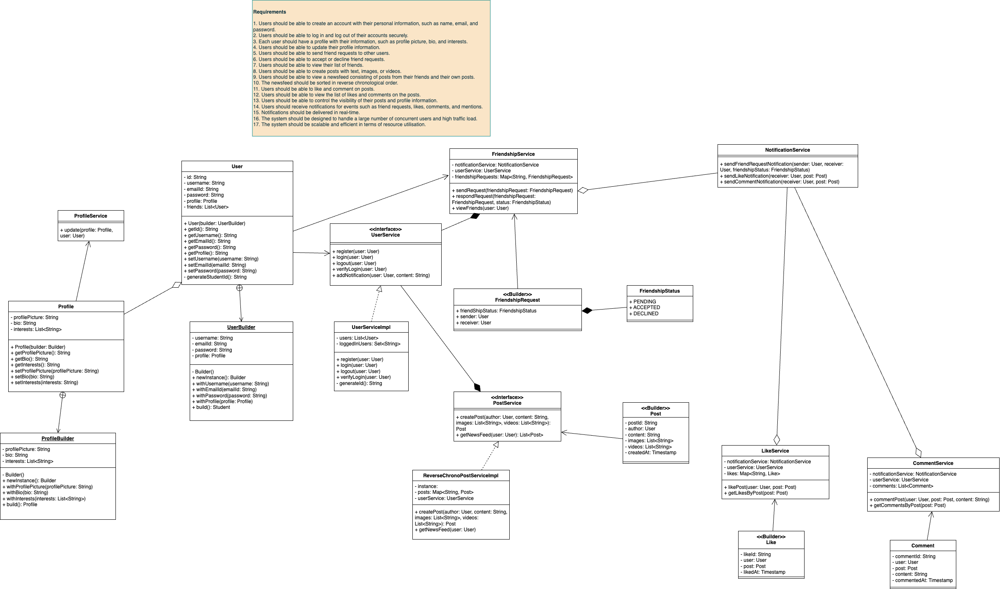

# LLD

### Demo
```angular2html
/Library/Java/JavaVirtualMachines/amazon-corretto-17.jdk/Contents/Home/bin/java -javaagent:/Applications/IntelliJ IDEA.app/Contents/lib/idea_rt.jar=64124:/Applications/IntelliJ IDEA.app/Contents/bin -Dfile.encoding=UTF-8 -classpath /Users/pochasri/temp/System_Design/FriendConnect/target/classes com.makefriend.Main
pochana logged in successfully
srikar logged in successfully
reddy logged in successfully
Hey srikar you have a new notification: User pochana sent you a friend request
Hey pochana you have a new notification: User srikar accepted your friend request
Hello World
Hello Moon
Hey pochana you have a new notification: User reddy liked your post: Hello World
Hey pochana you have a new notification: User srikar liked your post: Hello World
You like your own post
Hey pochana you have a new notification: User pochana liked your post: Hello World
Total number of like to post: Hello World is 3
reddy
srikar
pochana
Hey pochana you have a new notification: User pochana commented on your post: Hello World
Hey pochana you have a new notification: User srikar commented on your post: Hello World
Total number of comments to post: Hello World is 2
pochana: This is a comment
srikar: This is another comment

Process finished with exit code 0

```